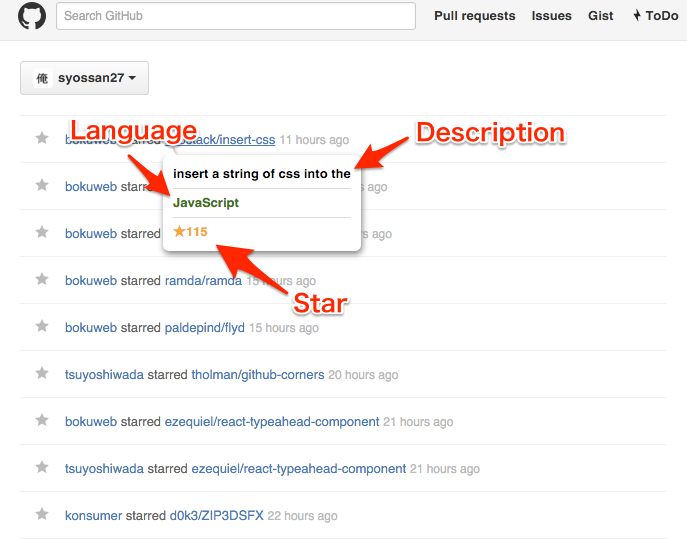

# github-brief-description

A description of the star has been the github repository by other users,
when move the cursor on github repository link.

## Description

## Install

Install here.

[github-brief-description](https://chrome.google.com/webstore/detail/github-brief-description/mhbnfmfikhhnlgbbdkhaamkbkfejeclh?hl=ja)

## License

[MIT](http://opensource.org/licenses/mit-license.php)

## Author

[syossan27](https://github.com/syossan27)

## Copyright

Icon create: flaticon

http://jp.freepik.com/free-icon/github-logo_696676.htm
